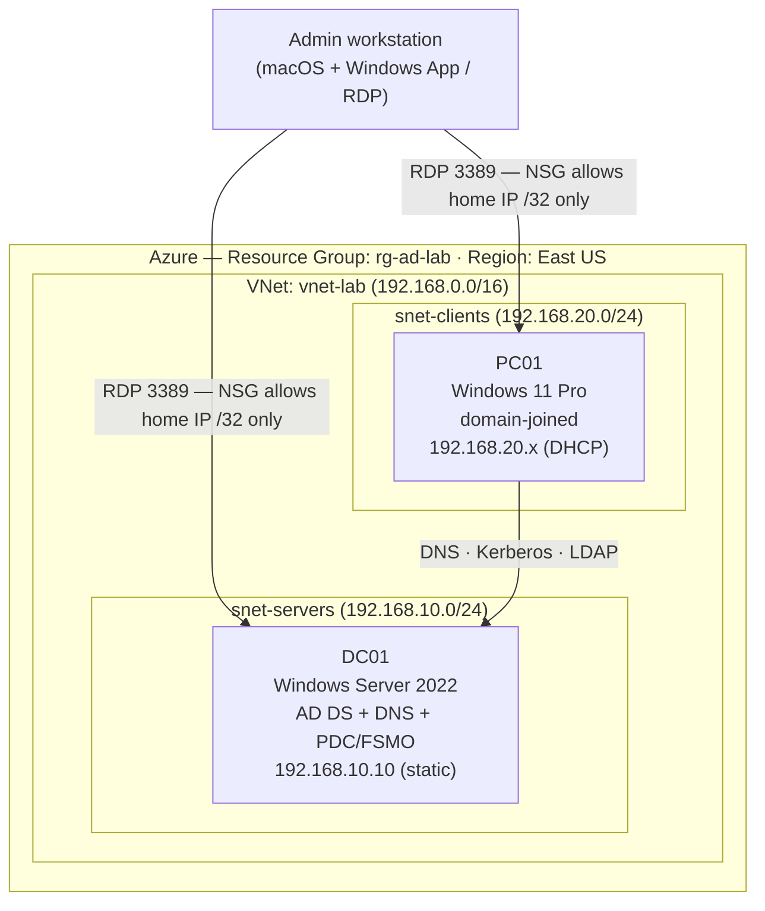

# Active Directory Domain Services on Azure

> A hands-on lab — identity, DNS, segmented networking, and Group Policy, built and validated in Microsoft Azure with PowerShell.

---

## Overview

**In plain terms:** this project builds the "who are you and what are you allowed to do" backbone that nearly every business runs on. When someone logs into a work computer, an invisible system verifies their identity, decides what they can access, and pushes configuration rules to their machine. I built that system from scratch — in the cloud.

**Technically:** I deployed an Active Directory forest (AD DS + DNS) on Azure IaaS, built a segmented virtual network with network security groups, domain-joined a Windows 11 client, and implemented identity and policy management — Organizational Units, users, AGDLP group nesting, and Group Policy Objects — validating each layer with native diagnostic tooling (`dcdiag`, `nltest`, `gpresult`).

The point of the project isn't scale — it's **depth**: three areas that usually sit in separate job descriptions (systems/identity, cloud infrastructure, and security) working together, with the reasoning behind every decision and the troubleshooting documented.

### Lab scope (honest framing)
This is a **single-DC lab environment**, not a production deployment. It demonstrates the core concepts an enterprise environment is built on rather than high availability or scale. Everything was implemented with production-correct patterns where practical (least privilege, network segmentation, cost discipline) and notes are included where a real deployment would differ.

---

## Architecture

**Domain:** `lab.internal` (NetBIOS `LAB`) · **Forest/Domain functional level:** Windows Server 2016

| Host | Role | Subnet | IP | OS |
|------|------|--------|----|----|
| DC01 | Domain Controller, DNS | snet-servers | 192.168.10.10 (static at NIC) | Windows Server 2022 Datacenter (Azure Edition, Gen2) |
| PC01 | Domain-joined client | snet-clients | 192.168.20.x (Azure DHCP) | Windows 11 Pro 24H2 (Gen2) |

> Note: `.internal` is used (not `.local`) — ICANN reserved `.internal` for private networks in 2024; `.local` conflicts with mDNS.

---

## What was built

**1 · Domain Controller (DC01)**
Deployed a Windows Server 2022 VM, pinned a static IP at the Azure NIC layer (`192.168.10.10`), installed the AD DS role, and promoted it to the first DC in a new forest (`lab.internal`). DNS installed AD-integrated alongside it.
`Install-WindowsFeature AD-Domain-Services` → `Install-ADDSForest`

**2 · Verification**
Confirmed forest health before building on it: `Get-ADDomain`, `Get-ADForest`, `Get-DnsServerZone` (forward zone + `_msdcs`), and `dcdiag /test:dns` — all AD-specific tests passing.

**3 · Segmented network + secure access**
Built `vnet-lab` with separate server and client subnets, and NSGs that permit RDP (3389/TCP) **only from a single administrative source IP (`/32`)** — no internet-wide exposure. Pointed the VNet's custom DNS at the DC so clients resolve the domain.

**4 · Domain-joined client (PC01)**
Deployed a Windows 11 Pro VM in the client subnet, verified it received the DC as its DNS server, confirmed the DC was reachable (`nltest /dsgetdc:lab.internal`), and joined it to the domain (`Add-Computer`).

**5 · Identity: OUs, users, AGDLP groups**
Created Organizational Units (Lab Users / Lab Groups / Lab Workstations), domain users, and groups following the **AGDLP** model — users placed in Global groups by role, Global groups nested into Domain Local groups by resource. Verified a user inherited a Domain Local group's membership *through* its Global group.

**6 · Group Policy**
Authored a GPO, linked it to the correct OUs, and confirmed via `gpresult` that it applied to a real domain user — with the user showing correct AGDLP group membership in the same output.

---

## Key concepts demonstrated

Each of these is a load-bearing idea, in plain + technical form:

- **DNS is the heartbeat of AD.** *Plain:* if machines can't look up "where's the domain server," nothing works. *Technical:* clients locate the DC via SRV records in the `_msdcs` zone; misconfigured client DNS is the #1 domain-join failure — which is why client DNS was pointed at the DC before every join.
- **AGDLP group strategy.** *Plain:* sort people into "who they are" buckets and resources into "what they open" buckets, then link the buckets. *Technical:* Accounts → Global groups → Domain Local groups → Permissions; add a person once and they inherit access. Verified with nested membership.
- **GPO scope follows the object's OU, by configuration type.** *Plain:* a rule only reaches a person or PC if it's attached to the folder they actually sit in. *Technical:* Computer settings key off the computer's OU, User settings off the user's OU — a user-config GPO linked only to a computers OU silently does nothing.
- **Cloud inverts on-prem habits.** Static IPs and DNS are set at the Azure fabric layer, not inside the OS; DHCP and broadcast behave differently in a VNet; addressing is a platform service.
- **Security: least privilege + no exposed RDP.** RDP locked to a `/32` source (internet-facing RDP is a top ransomware vector); authentication != authorization (a user could authenticate but couldn't RDP in until added to *Remote Desktop Users*).
- **Cost discipline.** VMs deallocated when idle (Stopped != Deallocated for billing), auto-shutdown scheduled, burstable/standard tiers chosen — the whole lab runs inside free credit.

---

## Skills demonstrated

`Active Directory (AD DS)` · `DNS` · `Group Policy (GPO)` · `Windows Server 2022` · `Azure IaaS` · `Azure Virtual Networks / NSGs / subnets` · `VM lifecycle & cost management` · `PowerShell` · `Identity & access management (OUs, AGDLP)` · `Least-privilege security` · `Systems troubleshooting (dcdiag, nltest, gpresult)`

---

## Evidence / screenshots

Screenshots live in `/screenshots`.

| File | Caption |
|------|---------|
| `01-azure-vms.png` | DC01 and PC01 running in resource group `rg-ad-lab` (East US) |
| `02-vnet-subnets.png` | Segmented VNet — `snet-servers` and `snet-clients` |
| `03-nsg-rdp-rule.png` | NSG inbound rule: RDP allowed from admin IP `/32` only |
| `04-dcdiag-dns.png` | `dcdiag /test:dns` — DC01 passes DNS health checks |
| `05-pc01-dns.png` | PC01 `ipconfig /all` — DNS server points to the DC (192.168.10.10) |
| `06-domain-join.png` | Join confirmed both sides: PC01 in domain + `Get-ADComputer` on DC |
| `07-ou-users-groups.png` | OU structure, domain users, and AGDLP group nesting |
| `08-gpo-applied.png` | `gpresult` — `Lab-Desktop-Policy` applied to a domain user, with AGDLP group membership |

---

## Troubleshooting log (selected)

Real failures encountered and resolved — included because diagnosing them *is* the skill:

- **Domain join / GPO "not applying"** → traced to object OU placement and login identity (local vs domain account); GPO reached the user only once linked to the user's OU.
- **User couldn't RDP in** → authentication succeeded but authorization failed; resolved by adding the user to *Remote Desktop Users* (auth != authz).
- **`*-Local*` command "group not found" on the DC** → DCs have no local groups; the command belonged on the member workstation.
- **VM size `NotAvailableForSubscription`** → size availability varies by subscription, region, zone, and security type — selected an available SKU rather than assuming.

---

## Reproducing this lab

Full step-by-step build notes, the addressing plan, and per-phase "why it matters" notes are maintained in the build notebook (`AD-Lab-Notebook.md`). High level:

1. Azure: resource group → VNet (two subnets) → DC VM (static NIC IP, NSG `/32`).
2. Promote DC (`Install-ADDSForest`), verify (`dcdiag`), point VNet DNS at the DC.
3. Client VM in the client subnet → confirm DNS → `Add-Computer` to join.
4. OUs, users, AGDLP groups, GPO → validate with `gpresult`.

---
